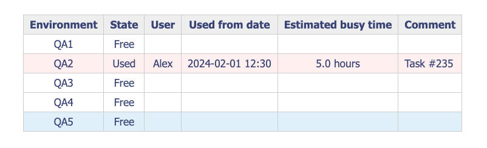

# Resource Management for Confluence

This Confluence macro app, **BusyResource**, helps teams manage resource availability (e.g., environments, servers) by marking them as free or busy. Built using Atlassian Forge, it integrates seamlessly with Confluence pages.



## Overview

The **BusyResource** app allows Confluence users to track and manage resource usage. Users can add the macro to any Confluence page, configure resources (e.g., QA1, QA2), and view their availability.

## Prerequisites

Before installing, ensure you have the following:

- **Node.js**: Version 22.x. Verify with:
  ```bash
  node -v
  ```
- **Forge CLI**: Install globally using:
  ```bash
  npm install -g @forge/cli
  forge --version
  ```
- **Atlassian Account**: Access to a Confluence Cloud workspace (e.g., `https://example.atlassian.net`).
- **API Token**: Generate one at [Atlassian API Tokens](https://id.atlassian.com/manage/api-tokens).
- **Workspace**: Create or access a Confluence workspace at [Atlassian Cloud](http://go.atlassian.com/cloud-dev).

## Installation

Follow these steps to set up and deploy the app:

1. **Clone the Repository**:
   ```bash
   git clone <repository-url> BusyResource
   cd BusyResource
   ```

2. **Log in to Forge**:
   Use your Atlassian email and API token:
   ```bash
   forge login
   ```

3. **Set Up Workspace**:
   Create a `.env` file with your Confluence workspace:
   ```bash
   echo "FORGE_WORKSPACE=example.atlassian.net" > .env
   ```
   Replace `example.atlassian.net` with your workspace URL.

4. **Install Dependencies and Build**:
   ```bash
   npm run build
   ```

5. **Register the App**:
   Register the app with Forge:
   ```bash
   forge register BusyResource
   ```
   The app will appear in your [Atlassian Developer Console](https://developer.atlassian.com/console/myapps).

6. **Deploy the App**:
   Deploy to your Confluence workspace:
   ```bash
   npm run install-prod
   ```
   For development, use:
   ```bash
   npm run install-dev
   ```

7. **Enable App Sharing**:
   To make the app accessible to all users in your workspace without requiring individual access requests:
   - Go to the [Atlassian Developer Console](https://developer.atlassian.com/console/myapps)
   - Select your app from the list.
   - Navigate to: Distribution > Edit
   - Under "Sharing", enable sharing with all users.
   - Click "Save changes".


## Add app to page
Go to any workspace page (`https://example.atlassian.net/wiki/spaces`), press edit page, and type (do not copy):
```
/BusyResource
```

Select app to add. Press edit button on the bottom of loaded app to open app settings.
Type resource names separated by ";", for example:
```
QA1;QA2;QA3;QA4;QA5
```

Close app settings, save page changes ("Update" button).
